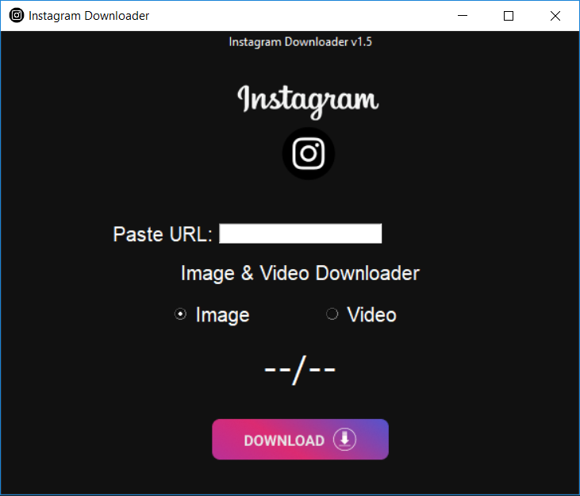

# Instagram-DL
This is Instagram Downloader Tool coded in Python3. Helps to download Instgram Pictures & Videos by Post Link.

### Preview:


## Thanks to:
- [AmshenShanu07](https://github.com/AmshenShanu07)
- [Palahsu](https://github.com/palahsu)
- [AbirHasan2005](https://github.com/AbirHasan2005)

## Made For:
- Linux
- Windows
- Mac

## Requirements:
- Python3
- pip3
- Git or Wget
- GUI Support

## Setup & Run:
```
git clone https://github.com/AbirHasan2005/instagram-dl
cd instagram-dl
python -m install -r requirements.txt
python instagram-dl.py
```

<details>
  <summary>Important</summary>

This is in development. Could be buggy. If you get any kind of error please report in [issues](https://github.com/AbirHasan2005/instagram-dl/issues). Also you can report on my [Telegram Group](http://t.me/linux_repo). Also this is available on [SourceForge](https://sourceforge.net/projects/instagram-dl/) as EXE File for Windows.

#### SourceForge:
<a href="https://sourceforge.net/projects/instagram-dl/"></a>

</details>

#### Telegram Group:
<a href="https://t.me/linux_repo"></a>

## Follow on:
<p align="left">
<a href="https://github.com/AbirHasan2005"></a>
</p>
<p align="left">
<a href="https://twitter.com/AbirHasan2005"></a>
</p>
<p align="left">
<a href="https://facebook.com/AbirHasan2005"></a>
</p>
<p align="left">
<a href="https://instagram.com/AbirHasan2005"></a>
</p>
